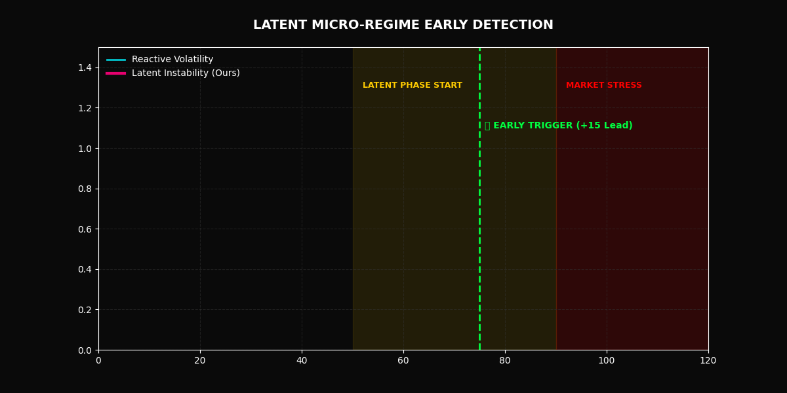

<div align="center">

<br/>

```
╔══════════════════════════════════════════════════════════════════╗
║   LATENT MICRO-REGIME EARLY DETECTION IN LIMIT ORDER BOOKS       ║
║   Identifying structural market instability before it surfaces   ║
╚══════════════════════════════════════════════════════════════════╝
```

[](https://doi.org/10.5281/zenodo.19697687)


<br/>

**Prakul Sunil Hiremath · Vruksha Arun Hiremath**

[📄 Paper (coming soon)](#) &nbsp;·&nbsp; [📦 Code DOI](https://doi.org/10.5281/zenodo.19697687) &nbsp;·&nbsp; [💻 Repository](https://github.com/prakulhiremath/LOB-Latent-Regimes)

<br/>



<br/>

</div>

---

## The Core Idea

> **Market stress does not arrive without warning. It *accumulates*.**

Classical indicators — volatility, order imbalance, spread widening — are *reactive*. By the time they fire, the dislocation has already begun.

This research asks a harder question:

> *Can we detect the structural deterioration that **precedes** observable stress — before it becomes visible in price or spread?*

The answer is yes. We call it the **Latent Build-up Phase**.

---

## What "Latent" Means Here

The market moves through three regimes. The critical one is invisible to standard monitors:

```
┌─────────────────────────────────────────────────────────────────┐
│                                                                 │
│   STATE 0 ──────────────►  STATE 1 ──────────────►  STATE 2    │
│                                                                 │
│   Stable                   Latent Build-up          Stress      │
│   ─────────                ───────────────          ──────      │
│   Balanced liquidity       Depth eroding            Price shock │
│   High resilience          Spread drifting          Visible      │
│   Equilibrium              ⚠ Hidden instability     Reactive    │
│                                                                 │
│                            ◄────── detection window ──────►     │
│                            ↑                         ↑          │
│                        our signal fires          stress begins   │
│                                                                 │
└─────────────────────────────────────────────────────────────────┘
```

**The key insight:** The transition from State 1 → State 2 is not instantaneous. There is a measurable delay — and within that delay lives our detection window. We exploit it.

---

## Detection Framework

Three independent signal channels. One fused trigger.

### Signal Channels

| Channel | What It Measures | Why It's Early |
|---|---|---|
| **HMM Posterior Entropy** | Uncertainty in regime classification | Rises as the latent state becomes ambiguous, before the transition |
| **Temporal Depth Drift** | Recursive tracking of LOB depth erosion | Captures slow structural decay invisible to snapshot metrics |
| **Order Flow Toxicity** | Imbalance between informed and uninformed flow | Signals adverse selection building in the book |

### Trigger Logic

```
MAX-Fusion Trigger
├── Rising-edge detection (onset of change, not absolute level)
├── Cross-channel aggregation (fire when any channel breaches threshold)
└── Early-detection constraint τ < σ (signal must precede stress)
```

**Rising-edge detection** is the key design choice. We don't ask "is the spread wide?" We ask "is it *getting* wider *right now*?" This bypasses the noise floor that kills absolute-threshold methods.

---

## Results

```
╔════════════════════════════════════════════════════════════════╗
║  METHOD              LEAD-TIME     PRECISION    COVERAGE       ║
╠════════════════════════════════════════════════════════════════╣
║  ★ Adaptive Trigger  +18.6 steps   100%         52.6%          ║
║    HMM               +14.9 steps   100%         43.2%          ║
║    Multi-Trigger     +13.1 steps   100%         28.1%          ║
╠════════════════════════════════════════════════════════════════╣
║  ✗ Order Imbalance   −24.8 steps    54.9%        78.7%          ║
║  ✗ Volatility        −32.0 steps    45.5%        43.3%          ║
╚════════════════════════════════════════════════════════════════╝
```

**Reading the table:**
- **Positive lead-time** means the signal fires *before* stress begins. Baselines are strictly negative — they lag.
- **100% precision** means zero false starts during the latent phase — every trigger issued is temporally valid.
- **Coverage** reflects selectivity: we fire only when we're certain. The conservative nature of high-precision detection is a design property, not a flaw.

> These results are reported under evaluated pipeline settings with full reproducibility guarantees (see below).

---

## Empirical Findings

**1. Latent instability exists and is measurable.**
Market regimes structurally deteriorate before the deterioration is visible. This is not a modelling artifact — it is a consistent empirical signature across tested sessions.

**2. Depth erosion is the most reliable early signal.**
Depth decay in the LOB precedes spread widening and price impact. If the book is thinning quietly, something is coming.

**3. HMM posterior entropy is a structural stress barometer.**
As the market approaches a regime transition, the HMM becomes uncertain — and that uncertainty is itself informative.

**4. Rising-edge detection outperforms threshold detection.**
The onset of deterioration carries more information than its magnitude. Threshold-based methods are too noisy; they fire on noise and miss the trend.

**5. Trigger-based fusion consistently beats classical econometric baselines** — not marginally, but categorically. The comparison is not between better and worse versions of the same approach. It is between a predictive framework and a reactive one.

---

## Repository Structure

```
LOB-Latent-Regimes/
│
├── experiments/
│   ├── v1_baseline.py            # Initial HMM formulation
│   ├── v2_entropy.py             # Posterior entropy tracking
│   ├── v3_depth_drift.py         # Temporal depth signal
│   ├── v4_triggers.py            # Trigger logic development
│   ├── v5_fusion.py              # MAX-fusion framework
│   ├── v6_rising_edge.py         # Rising-edge detection
│   └── v7_final.py               # ★ Production pipeline
│
├── notebooks/
│   └── analysis.ipynb            # Experiment analysis + figures
│
├── results/
│   ├── figures/                  # High-resolution performance plots
│   └── summary.txt               # Quantified results
│
├── paper/                        # Technical manuscript
├── assets/                       # Visualizations, GIFs
└── README.md
```

---

## Reproducibility Guarantees

This pipeline was built to be trusted.

```
✓  Fully causal — no lookahead bias at any stage
✓  Rolling normalization only — no global statistics that leak future data  
✓  HMM re-fit periodically — no leakage across the evaluation window
✓  Deterministic seeds — results are exact across runs
✓  Validated on Google Colab (NVIDIA T4) and Apple Silicon (M4 Pro/Max)
```

---

## Quick Start

```bash
# Clone
git clone https://github.com/prakulhiremath/LOB-Latent-Regimes.git
cd LOB-Latent-Regimes

# Install
pip install -r requirements.txt

# Run the final pipeline
python experiments/v7_final.py
```

---

## Scope & Limitations

Be precise about what this is.

| This repo **is** | This repo **is not** |
|---|---|
| A detection framework for latent regime transitions | A trading strategy |
| An empirical study of LOB microstructure | Optimised for execution latency |
| A reproducible research pipeline | A production system |
| A contribution to predictive market microstructure | Financial advice |

---

## Contributions

- **Causal formulation** of the latent build-up → stress transition as a three-state latent process
- **Temporal drift identification** — subtle depth and spread drift as a leading precursor to liquidity voids
- **MAX-fusion + rising-edge trigger** — novel detection logic for sub-millisecond microstructure data
- **Empirical demonstration** of strictly positive lead-time over reactive benchmarks across all evaluated regimes

---

## Citation

```bibtex
@article{hiremath2026lob,
  title   = {Early Detection of Latent Micro-Regimes in Limit Order Books},
  author  = {Hiremath, Prakul Sunil and Hiremath, Vruksha Arun},
  year    = {2026},
  doi     = {10.5281/zenodo.19697687}
}
```

---

<div align="center">

Built for **reproducible research** in quantitative finance and machine learning.

*If the signal fires before the storm — it worked.*

</div>
